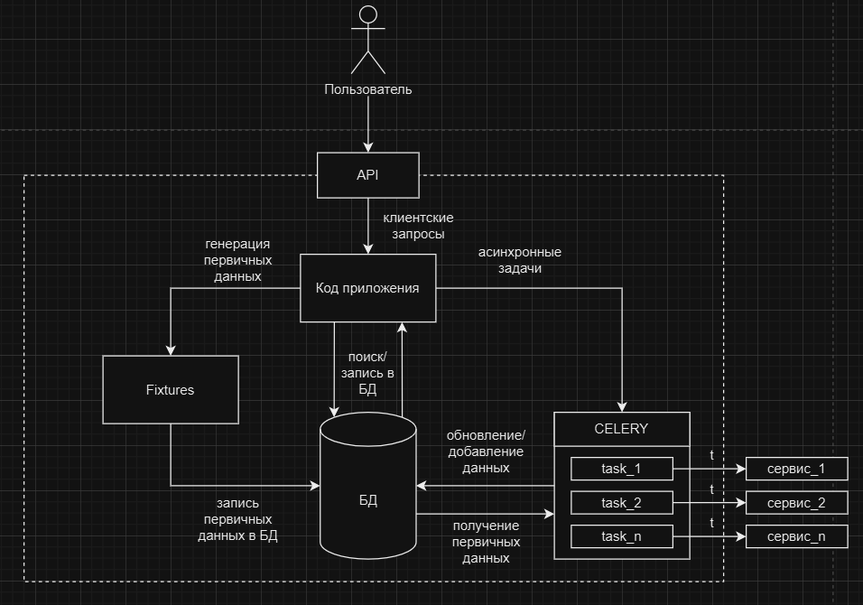

<h1 align="center">Проект конвертации валют: CurrencyConverterAPI</h1>

## Данный проект представляет собой API с использованием Django Rest Framework, базой Postgres и сервиса ExchangeRate-API с последующей сборкой в Docker.

### Проект выполнен группой ЭМС-171, команда ITSuperFriends: Овчинников, Ликсюткина, Лисица, Юсипов.

### 1. Установка зависимостей.
``` 
pip install -r requirements.txt
```

### 2. Создать свой .env файл в корне проекта.

### 3. Заполнить .env файл:
```xml
SECRET_KEY=django-insecure-ptxj-r*tqh1#08n+2+09582l%q(2nctus0z_4=0)93ly0n%2$8
DEBUG=TRUE
DB_NAME=db
DB_USER=postgres
DB_PASSWORD=postgres
DB_HOST=127.0.0.1
DB_PORT=5432
EXCHANGE_RATE_API_KEY=347aedda8f157b2e2cf1b4ab
```


### 4. Выполнить миграции.
```sh
python ./manage.py migrate 
```

### 5. Запустить сервер.
```sh
python ./manage.py runserver
```
### 6. Запуск всех образов.
```sh
docker-compose up --build -d
```

## Архитектура проекта:

### Пользователь обращается к нашему API за счет клиентского запроса к коду приложения, и в зависимости от запроса происходит обращение к разным модулям (генерация данных или прямой запрос в БД)
### Асинхронные задачи (CELERY) выполняются независимо от клиентского запроса. Celery task выполняет запрос на сторонний сервис для получения актуальных данных о валютах в определенный промежуток времени.
### Модуль Fixtures создан для генерации первичных данных, которые содержат некоторую информацию о валютах (название и код валюты). Данные этого модуля сохраняются в БД и впоследствии взаимодействуют с модулем CELERY.

